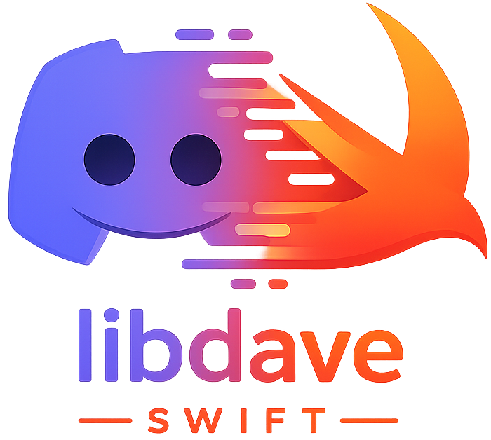

<p align="center">
  
</p>

<h1 align="center">libdave-swift</h1>

<p align="center">
  <a href="https://swift.org"></a>
  <a href="https://www.swift.org/package-manager/"></a>
  <a href="Package.swift"></a>
</p>

Swift bindings for [Discord's DAVE](https://daveprotocol.com/) (Audio & Video End-to-End Encryption) protocol, built for Discord Voice clients such as [SwiftBot](https://github.com/johnwatso/SwiftBot).

Requires macOS 26+ on Apple Silicon and Swift 6. The native DAVE/MLS implementation is bundled; Intel and Rosetta targets are unsupported.

## Features

- **Coordinator-first API** — an actor that serializes Discord Voice's MLS state machine.
- **Media crypto** — typed gateway events plus audio encryption and per-speaker decryption.
- **Safe recovery** — replay-safe outbound actions, readiness gating, and recovery hints.
- **Verification and visibility** — roster checks, persistent identities, and bounded diagnostics.

Start with `DaveSessionCoordinator`. The lower-level wrappers are not `Sendable` and must be externally serialized.

## Install

Add a tagged release to `Package.swift`:

```swift
dependencies: [
    .package(url: "https://github.com/johnwatso/libdave-swift.git", exact: "3.0.1")
]
```

Then add the product to your target:

```swift
.target(
    name: "MyTarget",
    dependencies: [
        .product(name: "libdave-swift", package: "libdave-swift")
    ]
)
```

In Xcode, use **File → Add Package Dependencies…**, enter the repository URL, choose a release, and add `libdave-swift` to the target. Import it as `libdave_swift`.

## Quick start

Feed the coordinator the real DAVE payloads received from Discord's Voice gateway. IDs must be non-zero decimal Discord Snowflakes.

```swift
import Foundation
import libdave_swift

let coordinator = DaveSessionCoordinator(authSessionId: persistentSessionID)

try await coordinator.configureDiscordVoiceSession(
    groupId: guildID,
    selfUserId: selfUserID,
    protocolVersion: daveVersion
)

// Send actions and acknowledge them only after the gateway write succeeds.
func deliver(_ result: DiscordDaveGatewayResult) async throws {
    for envelope in result.pendingActions {
        try await sendToVoiceGateway(envelope.action)
        await coordinator.acknowledgeDiscordGatewayAction(envelope.id)
    }
}

let registered = try await coordinator.consumeDiscordGatewayEvent(
    .externalSender(externalSenderBytes)
)
try await deliver(registered)

let transition = try await coordinator.consumeDiscordGatewayEvent(
    .welcome(
        welcomeBytes,
        transitionId: transitionID,
        recognizedUserIds: rosterSnowflakeIDs
    )
)
try await deliver(transition)

// Do not process media until Discord sends the matching Execute Transition.
let executed = try await coordinator.consumeDiscordGatewayEvent(
    .executeTransition(transitionID)
)
try await deliver(executed)
guard executed.mediaReady else { throw DaveError.mediaNotReady }

let encrypted = try await coordinator.encryptDiscordAudioFrame(opusFrame, ssrc: audioSSRC)
let decrypted = try await coordinator.decryptDiscordAudioFrame(
    incomingEncryptedPayload,
    from: remoteSnowflakeID
)
```

After reconnecting, use `pendingDiscordGatewayActions()` to resend unacknowledged actions. Check `recoveryHint` for recovery work, and surface `unrecognizedRosterUserIds` after a transition. The [migration guide](Docs/MIGRATING_TO_2.0.md) documents the complete gateway contract.

## Development

```bash
swift test
```

`Scripts/build-native-framework.sh` rebuilds the pinned native stack and its
test-only external sender. The resulting runtime integration test establishes
and rekeys a real three-member MLS group and exchanges encrypted media; see the
[integration contract](Docs/MLS_INTEGRATION_FIXTURES.md). Native versions,
licenses, SBOM, and verification instructions are in
[THIRD_PARTY_NOTICES.md](THIRD_PARTY_NOTICES.md).

## More

- [Security policy](SECURITY.md)
- [Changelog](CHANGELOG.md)
- [Migration guide](Docs/MIGRATING_TO_2.0.md)

## License

The Swift source in this repository is MIT licensed — see [LICENSE](LICENSE).

That license does **not** replace the licenses of third-party components bundled
in `Frameworks/Dave.xcframework`. Their exact revisions and applicable license
texts are recorded in [THIRD_PARTY_NOTICES.md](THIRD_PARTY_NOTICES.md) and in the
framework's SPDX SBOM and `Licenses` directory.
